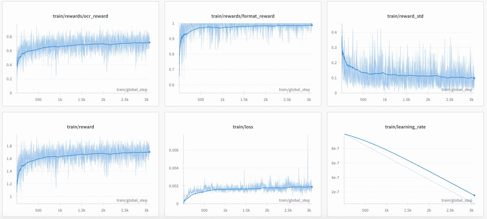
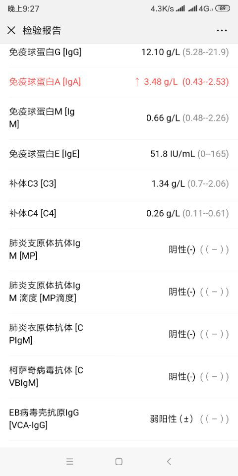

# SMR-R1: Reinforcing Ability to Extract Structured Information From Medical Reports in Vision Language Models

[](https://github.com/yingyukexiansheng/SMR-R1)
[](LICENSE)

## 🎯Overview

Given the remarkable performance of the GRPO algorithm on the DeepSeek-R1 model, we have also applied GRPO to the field of medical report structured extraction. We conducted reinforcement training on the Qwen2.5VL-7B model, and the results showed an improvement of 15 percentage points (pp) on the evaluation set compared to the Qwen2.5VL-7B model, 15 pp higher than the SFT training on the same model with the same data, and 7 pp higher than the Qwen2.5VL-72B model. This project aims to provide a solution for the structured extraction of medical reports. We have open-sourced the following content:
- A desensitized medical report structured data evaluation set [🤗 SMR-R1 Dataset](https://huggingface.co/datasets/mrlijun/SMR-R1)
- A medical report structured extraction model [🤗 SMR-R1 Model](https://huggingface.co/mrlijun/SMR-R1)
- Methods for evaluating medical report structured extraction

Through this project, researchers and developers can quickly get started with the task of structured extraction of medical reports and further conduct research and application development using the provided data and models.


## 🍖 Dataset

We have open-sourced a structured data evaluation set for medical reports. This dataset features the following characteristics:

- **Diversity and Representativeness**: The dataset encompasses various types of medical reports, such as medical records, examination reports, and diagnostic reports. It covers a range of imaging conditions, including fluoroscopy, oblique views, and variations in lighting intensity. Additionally, it includes non-medical report-related images (e.g., medicine boxes) to assess the model's ability to filter out non-medical images.

- **High-Quality Annotation**: All data has been annotated and reviewed by professional medical personnel to ensure accuracy and reliability.

- **Data Anonymization**: To protect patient privacy, all information in the dataset has been anonymized to ensure that no personally identifiable information is included.


## 🔄 Model

We have open-sourced a medical report structured extraction model based on qwen2.5-vl-7b

### 🧪 Evaluation
Modify MODEL_PATH, DATA_ROOT, IMAGE_ROOT in evaluate.py to your local directory, and then run the following command to evaluate the model performance:
```bash
python evaluate.py
```

| Model       | Dataset       |Performance       |Description |
|:-----------|:-----------:|:-----------:|:-----------:|
| Qwen2.5-VL-7B-Instruct   | \    |54.71%    | \    |
| Qwen2.5-VL-72B-Instruct   | \   | 62.89%| \    |
| Qwen2.5-VL-7B-Instruct-sft   |  6k  | 55.21%|  (Supervised Fine-Tuning) training based on Qwen2.5-VL-7B-Instruct.   |
| Qwen2.5-VL-7B-Instruct-rl(SMR-R1)   |  6k  | 71.87%| (Reinforcement Learning) training based on Qwen2.5-VL-7B-Instruct.    |


### 📈 Training curve



### 😊 Extract display

```md
<think>
从图片中可以看到这是一个血液学检查报告，包含了多种免疫球蛋白和补体的水平以及一些特定抗体的检测结果。由于图片中没有提供患者的姓名、性别、年龄、检查时间、科室、检查名称、检查部位等信息，因此这些字段无法填写。此外，报告中也没有提供检查描述、诊断、处理建议、样本采集时间和其他相关信息。因此，我们将这些字段留空。
</think>
<answer>
{
    "姓名": "",
    "性别": "",
    "年龄": "",
    "检查时间": "",
    "科室": "",
    "检查名称": "",
    "检查部位": "",
    "指标": [
        {"项目名称": "免疫球蛋白G [IgG]", "结果": "12.10", "单位": "g/L", "参考范围": "5.28--21.9", "异常标记": "", "检测方法": "", "结果状态": "正常"},
        {"项目名称": "免疫球蛋白A [IgA]", "结果": "3.48", "单位": "g/L", "参考范围": "0.43--2.53", "异常标记": "↑", "检测方法": "", "结果状态": "偏高"},
        {"项目名称": "免疫球蛋白M [IgM]", "结果": "0.66", "单位": "g/L", "参考范围": "0.48--2.26", "异常标记": "", "检测方法": "", "结果状态": "正常"},
        {"项目名称": "免疫球蛋白E [IgE]", "结果": "51.8", "单位": "IU/mL", "参考范围": "0--165", "异常标记": "", "检测方法": "", "结果状态": "正常"},
        {"项目名称": "补体C3 [C3]", "结果": "1.34", "单位": "g/L", "参考范围": "0.7--2.06", "异常标记": "", "检测方法": "", "结果状态": "正常"},
        {"项目名称": "补体C4 [C4]", "结果": "0.26", "单位": "g/L", "参考范围": "0.11--0.61", "异常标记": "", "检测方法": "", "结果状态": "正常"},
        {"项目名称": "肺炎支原体抗体IgM [MP]", "结果": "阴性(-)", "单位": "", "参考范围": "", "异常标记": "", "检测方法": "", "结果状态": "正常"},
        {"项目名称": "肺炎支原体抗体IgM滴度 [MP滴度]", "结果": "阴性(-)", "单位": "", "参考范围": "", "异常标记": "", "检测方法": "", "结果状态": "正常"},
        {"项目名称": "肺炎衣原体抗体 [CPIgM]", "结果": "阴性(-)", "单位": "", "参考范围": "", "异常标记": "", "检测方法": "", "结果状态": "正常"},
        {"项目名称": "柯萨奇病毒抗体 [CVB-IgM]", "结果": "阴性(-)", "单位": "", "参考范围": "", "异常标记": "", "检测方法": "", "结果状态": "正常"},
        {"项目名称": "EB病毒壳抗原IgG [VCA-IgG]", "结果": "弱阳性(±)", "单位": "", "参考范围": "", "异常标记": "", "检测方法": "", "结果状态": "正常"}
    ],
    "检查描述": "",
    "诊断": "",
    "处理建议": "",
    "样本采集时间": "",
    "其他": ""
}
</answer>
```

## 📋️ TODO

- [X] Conduct reinforcement learning directly on the base model.
- [ ] Perform reinforcement learning after SFT (Supervised Fine-Tuning) on the base model.
- [ ] Do not impose restrictions on the extracted fields, allowing for the automatic structuring of medical reports.
- [ ] Due to the significant impact on results from incorrect identification of some values or terms in medical reports, it is not advisable to readily use edit distance as the reward. The reward method will be optimized to be determined by a large model in the future.

## Acknowledgements

We sincerely thank [DeepSeek](https://github.com/deepseek-ai/DeepSeek-R1), [QwenVL](https://github.com/QwenLM/Qwen2.5-VL), [vllm](https://github.com/vllm-project/vllm) (our initial codebase).


## 📚 Contributors and Citation


If you find this work useful, please cite it as follows:
```bib
@misc{lijun2025SMR-R1,
  author       = {Lijun Liu, Tao Zhang, Tao Zhang, Chong Li, Mingrui Wang, Chenglin Zhu, Mingan Lin, Zenan Zhou, Weipeng Chen},
  title        = {SMR-R1: Reinforcing Ability to Extract Structured Information From Medical Reports in Vision Language Models},
  howpublished = {\url{https://github.com/yingyukexiansheng/SMR-R1}},
  note         = {Accessed: 2025-03-26},
  year         = {2025}
}
```
